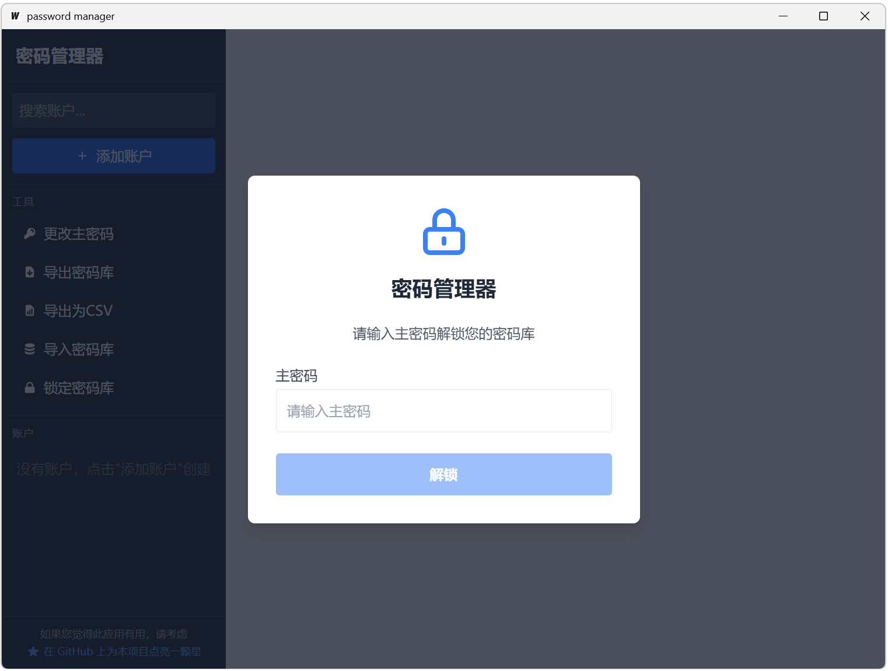
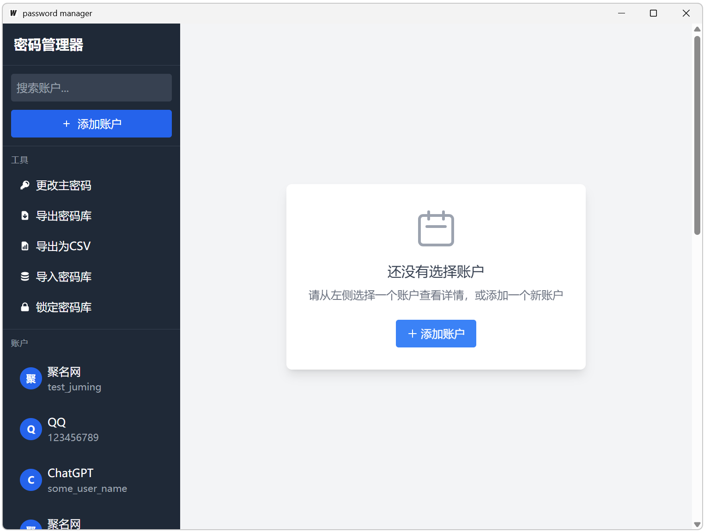
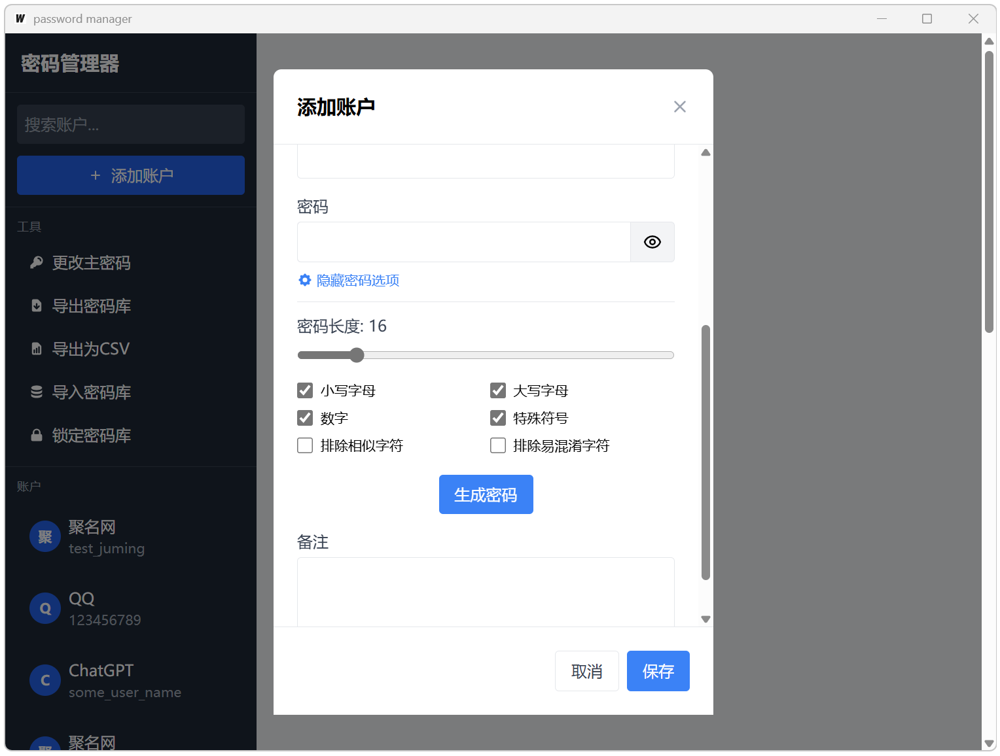
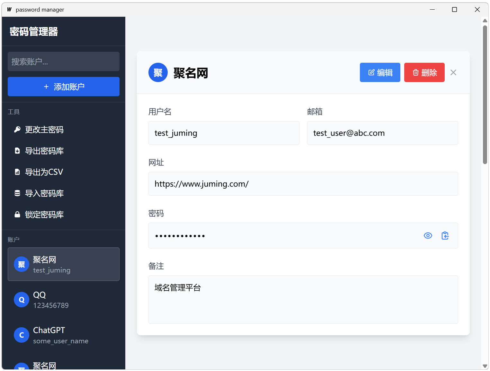

# Password Manager User Guide

[English](#introduction) | [简体中文](#简介)

## Introduction

This password manager provides both a command-line interface (CLI) and a graphical user interface (GUI) built with [Wails](https://wails.io/), for securely storing and managing account information for various websites and applications. It uses strong encryption to protect your password data and provides a rich set of management features. This program supports both Chinese (zh) and English (en) language interfaces.

## Features

- **Local & Lightweight**: Runs entirely on your local machine with no external dependencies or cloud services
- **Strong Security**: AES-256 encryption to protect your password data
- **Password Generation**: Creation of high-strength random passwords with customizable options
- **Comprehensive Storage**: Secure storage of account information including usernames, passwords, URLs, etc.
- **Intuitive GUI**: Graphical User Interface for easier management and improved user experience
- **Import/Export**: Flexible options for vault data backup and restoration
- **Master Password Management**: Secure master password changing capability
- **Advanced Search**: Account search and filtering by platform, username, or email
- **Clipboard Integration**: Password copying to clipboard with automatic clearing for security
- **Bilingual Interface**: Support for both Chinese and English languages

## Screenshots









## Installation

### Building from Source

This project includes build scripts for Linux/macOS (`build.sh`) and Windows (`build.bat`) that compile both the command-line (CLI) and graphical user interface (GUI) versions of the application.

1.  Clone the repository:
    ```bash
    git clone https://github.com/simp-lee/passwordmanager.git
    cd passwordmanager
    ```
2.  Run the build script for your operating system:
    -   For Linux/macOS:
        ```bash
        ./build.sh
        ```
    -   For Windows:
        ```bat
        .\build.bat
        ```
    This will create the executables in the `bin` directory. The GUI application is built using [Wails](https://wails.io/). The scripts will attempt to install Wails if it's not already present.

    After building, you can find the executables:
    -   CLI: `bin/passwordmanager` (or `bin\passwordmanager.exe` on Windows)
    -   GUI: `bin/passwordmanager-gui` (or `bin\passwordmanager-gui.exe` on Windows)

    You can then move these executables to a directory in your system's PATH if desired.

### Direct Installation

For users who prefer not to build from source, pre-compiled binaries are available for Windows, macOS, and Linux in the releases section of the repository. Simply download the appropriate version for your operating system and run it directly.

## Local Deployment Benefits

This password manager is designed with these key advantages:

1. **No Internet Required**: Works completely offline without any network connectivity
2. **No Cloud Storage**: All data stored locally on your machine for maximum privacy
3. **No External Dependencies**: Self-contained application with minimal system requirements
4. **Portable**: Can be run from a USB drive or any storage medium
5. **Lightweight**: Small memory footprint and efficient resource usage
6. **No Subscription Fees**: Free to use with no recurring payments

## Language Settings

This password manager uses English (en) interface by default. You can switch the language using the -L or --lang parameter:

```bash
# Use Chinese interface
passwordmanager -L zh list

# Use English interface
passwordmanager -L en list

# Default is English
passwordmanager list
```

Language settings apply to all commands, and you can switch languages anytime based on your preference. For example:

```bash
# Initialize with Chinese interface
passwordmanager -L zh init

# Add an account with English interface
passwordmanager -L en add
```

## Basic Usage

### Initialize Vault

Before first use, you need to create a password vault and set a master password:

```bash
passwordmanager init
```

The system will prompt you to enter a master password. Please use a strong password and make sure you don't forget it, as the master password cannot be recovered.

### Add New Account

```bash
passwordmanager add
```

Follow the prompts to enter account information, including platform name, username, email, etc. You can choose to manually enter a password or generate a random one.

### Generate Random Password

```bash
passwordmanager generate
```

By default, this generates a 16-character strong password that includes uppercase and lowercase letters, numbers, and special symbols. You can customize the generated password using the following options:

- `-l, --length` - Specify password length (default 16)
- `--no-lowercase` - Don't use lowercase letters
- `-U, --no-uppercase` - Don't use uppercase letters
- `-D, --no-digits` - Don't use numbers
- `-S, --no-symbols` - Don't use special symbols
- `-e, --exclude-similar` - Exclude similar characters (like l, 1, I, O, 0)
- `-a, --exclude-ambiguous` - Exclude potentially confusing characters (like {}, [], (), /)
- `-c, --copy` - Copy directly to clipboard

Example:
```bash
# Generate a 20-character password without special symbols and similar characters
passwordmanager generate -l 20 -S -e
```

### List All Accounts

```bash
passwordmanager list
```

Displays basic information for all accounts in the vault, including ID (16 hexadecimal character unique identifier), platform, username, and email.

### View Account Details

```bash
passwordmanager get <platform-name>
```

Displays detailed information for all accounts containing the specified platform name, but doesn't include passwords. The search is based on inclusion, not exact matching.

### View and Copy Password

```bash
passwordmanager password <account-ID>
```

Displays the password for the specified account ID. For security reasons, it will first ask if you are sure you want to display the password. If you choose not to display it, the system will offer the option to copy it to the clipboard.

Use the `-c` or `--copy` option to copy the password directly to the clipboard without displaying it:

```bash
passwordmanager password <account-ID> -c
```

Passwords copied to the clipboard will be automatically cleared after 30 seconds to enhance security.

### Update Account Information

```bash
passwordmanager update <account-ID>
```

Updates information for the account with the specified ID, including platform, username, email, password, etc. For fields you don't want to modify, simply press Enter to keep the original value.

### Delete Account

```bash
passwordmanager delete <account-ID>
```

Removes the account with the specified ID from the vault. Confirmation will be required before deletion.

### Search Accounts

```bash
passwordmanager search <query>
```

Searches for accounts where the platform name, username, or email contains the specified query.

## Advanced Features

### Change Master Password

```bash
passwordmanager change-master-password
```

Changes the master password for the vault. You'll need to enter your current master password for verification first.

### Export Vault

```bash
passwordmanager export <export-path>
```

Exports the encrypted vault to the specified file. The exported file remains encrypted and requires the master password to open.

### Import Vault

```bash
passwordmanager import <import-path>
```

Imports vault data from the specified file. This operation will overwrite the current vault data.

### Export to CSV File

```bash
passwordmanager export-csv <export-path>
```

Exports account data to CSV format. **Warning: Passwords in CSV files are stored in plain text. Handle the exported file with care.**

## GUI Features

The graphical interface provides an intuitive way to manage your passwords:

1. **Visual Password Management**: Easily view, add, edit, and delete accounts
2. **Password Strength Indicator**: Visual feedback on password strength (Weak/Medium/Strong)
3. **Customizable Password Generation**: Generate passwords with specific requirements through a simple interface
4. **One-Click Copy**: Copy passwords to clipboard with a single click
5. **Searchable Account List**: Quickly find accounts by typing in the search box
6. **Secure by Default**: Automatic locking of the vault when inactive
7. **Visual Password Options**: Toggle password visibility with an eye icon
8. **Streamlined Export/Import**: Simple dialogs for securely importing and exporting data

## Security Features

1. **Strong Encryption**: Uses AES-256-GCM encryption and PBKDF2 key derivation with 100,000 iterations
2. **Memory Safety**: All sensitive data (such as plaintext passwords) is securely cleared from memory immediately after use
3. **Clipboard Protection**: Passwords copied to the clipboard are automatically cleared after 30 seconds
4. **Input Protection**: Password input is not displayed on the screen
5. **Security Confirmation**: Dangerous operations (such as deleting accounts or exporting plain text) require confirmation
6. **Local Storage Only**: No data is ever sent over the network or stored in cloud services

## Security Recommendations

1. **Master Password Security**: Use a strong password as your master password, including uppercase and lowercase letters, numbers, and special characters.
2. **Regular Backups**: Use the `export` command to back up your vault regularly.
3. **Regular Password Updates**: Periodically update passwords for important accounts.
4. **Avoid Plain Text Export**: Unless necessary, avoid using `export-csv` to export passwords in plain text.
5. **Secure Environment**: Use the password manager on a device with up-to-date security patches and antivirus protection

## Troubleshooting

### Cannot Open Vault

If you forget your master password, vault data cannot be recovered. This is to ensure security.

### Vault File Corruption

If the vault file is corrupted, you can try to recover using a recent backup file:

```bash
passwordmanager import <backup-file-path>
```

### Data Directory Location

By default, vault data is stored in the `.passwordmanager` folder in the user's home directory:

- Windows: `C:\Users\<username>\.passwordmanager\`
- Linux/macOS: `~/.passwordmanager/`

## Command Reference

| Command                   | Description                                          |
|---------------------------|------------------------------------------------------|
| `init`                    | Initialize the password manager                      |
| `add`                     | Add a new account                                    |
| `generate`                | Generate a new password                              |
| `list`                    | List all accounts                                    |
| `get [platform]`          | Get details for accounts with the specified platform |
| `password [ID]`           | Show or copy the password for a specific account     |
| `update [ID]`             | Update an existing account                           |
| `delete [ID]`             | Delete an account by ID                              |
| `search [query]`          | Search accounts by platform, username, or email      |
| `change-master-password`  | Change the master password                           |
| `export [path]`           | Export the encrypted vault to a file                 |
| `import [path]`           | Import a vault from a file                           |
| `export-csv [path]`       | Export accounts to a CSV file (plain text passwords!)|

## Example Scenarios

### Create and Store a New Bank Account

```bash
# Initialize the vault
passwordmanager init

# Add a bank account
passwordmanager add
# Platform: MyBank
# Username: myusername
# Password: Choose "Generate random password"
# ...
```

### Find and Use a Password

```bash
# Search for the bank account
passwordmanager search MyBank

# Copy the password to clipboard (assuming ID is 4373126014574e97)
passwordmanager password 4373126014574e97 -c
```

### Update an Expired Password

```bash
# Generate a new password
passwordmanager generate -l 20 -e

# Update the account password (assuming ID is 4373126014574e97)
passwordmanager update 4373126014574e97
# Choose "Update password?: y"
# Choose "Generate random password?: y"
```

### Backup Vault

```bash
# Export encrypted vault
passwordmanager export ~/backup/vault-backup-2025-04-26.encrypted
```

---

# 密码管理器使用说明

[English](#introduction) | [简体中文](#简介)

## 简介

本密码管理器提供命令行界面 (CLI) 和一个使用 [Wails](https://wails.io/) 构建的图形用户界面 (GUI)，用于安全地存储和管理您的各种网站和应用的账户信息。它使用强加密技术保护您的密码数据，并提供了丰富的管理功能。本程序支持中文(zh)和英文(en)两种语言界面。

## 功能特点

- **本地化与轻量级**：完全在本地运行，无需外部依赖或云服务
- **强大安全性**：使用 AES-256 加密保护您的密码数据
- **密码生成**：创建高强度随机密码，支持自定义选项
- **全面存储**：安全存储账户的用户名、密码、URL等信息
- **直观界面**：图形用户界面 (GUI)，操作直观方便，提升用户体验
- **导入导出**：灵活的保险库数据备份和恢复选项
- **主密码管理**：安全的主密码更改功能
- **高级搜索**：支持按平台、用户名或邮箱搜索和过滤账户
- **剪贴板集成**：支持密码复制到剪贴板并自动清除
- **双语界面**：支持中文和英文两种语言

## 界面截图


## 安装

### 从源码编译

本项目包含了适用于 Linux/macOS (`build.sh`) 和 Windows (`build.bat`) 的构建脚本，这些脚本会编译应用程序的命令行 (CLI) 和图形用户界面 (GUI) 两个版本。

1.  克隆仓库：
    ```bash
    git clone https://github.com/simp-lee/passwordmanager.git
    cd passwordmanager
    ```
2.  运行适用于您操作系统的构建脚本：
    -   对于 Linux/macOS:
        ```bash
        ./build.sh
        ```
    -   对于 Windows:
        ```bat
        .\build.bat
        ```
    这将在 `bin` 目录下生成可执行文件。GUI 应用程序是使用 [Wails](https://wails.io/) 构建的。如果 Wails 尚未安装，脚本会尝试安装它。

    构建完成后，您可以找到可执行文件：
    -   CLI: `bin/passwordmanager` (或 Windows 上的 `bin\passwordmanager.exe`)
    -   GUI: `bin/passwordmanager-gui` (或 Windows 上的 `bin\passwordmanager-gui.exe`)

    如果需要，您可以将这些可执行文件移动到系统 PATH 路径下的某个目录中。

### 直接安装

对于不想从源码构建的用户，仓库的发布部分提供了适用于 Windows、macOS 和 Linux 的预编译二进制文件。只需下载适合您操作系统的版本并直接运行即可。

## 本地部署优势

这个密码管理器设计具有以下关键优势：

1. **无需互联网**：完全离线工作，不需要任何网络连接
2. **无云存储**：所有数据存储在本地设备上，确保最大隐私
3. **无外部依赖**：自包含应用程序，系统需求最小化
4. **便携性**：可以从 USB 驱动器或任何存储介质运行
5. **轻量级**：内存占用小，资源使用高效
6. **无订阅费**：免费使用，无需定期付款

## 语言设置

本密码管理器默认使用英文(en)界面。您可以通过 -L 或 --lang 参数切换语言：

```bash
# 使用中文界面
passwordmanager -L zh list

# 使用英文界面
passwordmanager -L en list

# 默认为英文
passwordmanager list
```

语言设置适用于所有命令，您可以根据个人偏好随时切换。例如：

```bash
# 使用中文界面初始化
passwordmanager -L zh init

# 使用英文界面添加账户
passwordmanager -L en add
```

## 基本使用

### 初始化保险库

首次使用前，需要创建密码保险库并设置主密码：

```bash
passwordmanager init
```

系统会提示您输入主密码。请使用强密码并确保不会忘记，因为主密码无法恢复。

### 添加新账户

```bash
passwordmanager add
```

按照提示输入账户信息，包括平台名称、用户名、邮箱等。您可以选择手动输入密码或生成随机密码。

### 生成随机密码

```bash
passwordmanager generate
```

默认生成一个16位的强密码，包含大小写字母、数字和特殊符号。您可以使用以下选项自定义生成的密码：

- `-l, --length` - 指定密码长度（默认16）
- `--no-lowercase` - 不使用小写字母
- `-U, --no-uppercase` - 不使用大写字母
- `-D, --no-digits` - 不使用数字
- `-S, --no-symbols` - 不使用特殊符号
- `-e, --exclude-similar` - 排除相似字符（如 l, 1, I, O, 0）
- `-a, --exclude-ambiguous` - 排除可能混淆的字符（如 {}, [], (), /）
- `-c, --copy` - 直接复制到剪贴板

示例：
```bash
# 生成一个20位的密码，不包含特殊符号和相似字符
passwordmanager generate -l 20 -S -e
```

### 列出所有账户

```bash
passwordmanager list
```

显示保险库中所有账户的基本信息，包括ID（16个十六进制字符的唯一标识符）、平台、用户名和邮箱。

### 查看账户详情

```bash
passwordmanager get <平台名称>
```

显示包含指定平台名称的所有账户详细信息，但不包括密码。搜索是基于包含关系，而非精确匹配。

### 查看和复制密码

```bash
passwordmanager password <账户ID>
```

显示指定ID账户的密码。出于安全考虑，会先询问是否确定要显示密码。如果选择不显示，系统会提供复制到剪贴板的选项。

使用 `-c` 或 `--copy` 选项可以直接复制密码到剪贴板而不显示：

```bash
passwordmanager password <账户ID> -c
```

复制到剪贴板的密码将在30秒后自动清除，以增强安全性。

### 更新账户信息

```bash
passwordmanager update <账户ID>
```

更新指定ID账户的信息，包括平台、用户名、邮箱、密码等。对于不需要修改的字段，直接按回车键保持原值。

### 删除账户

```bash
passwordmanager delete <账户ID>
```

从保险库中删除指定ID的账户。操作前会要求确认。

### 搜索账户

```bash
passwordmanager search <关键词>
```

搜索平台名称、用户名或邮箱中包含指定关键词的账户。

## 高级功能

### 更改主密码

```bash
passwordmanager change-master-password
```

更改保险库的主密码。需要先输入当前主密码进行验证。

### 导出保险库

```bash
passwordmanager export <导出路径>
```

将加密的保险库导出到指定文件。导出的文件仍然是加密的，需要主密码才能打开。

### 导入保险库

```bash
passwordmanager import <导入路径>
```

从指定文件导入保险库数据。此操作会覆盖当前的保险库数据。

### 导出为CSV文件

```bash
passwordmanager export-csv <导出路径>
```

将账户数据导出为CSV格式。**警告：CSV文件中的密码是明文存储的，请妥善保管导出的文件**。

## 图形界面功能

图形界面提供了直观的密码管理方式：

1. **可视化密码管理**：轻松查看、添加、编辑和删除账户
2. **密码强度指示器**：对密码强度的视觉反馈（弱/中/强）
3. **可自定义密码生成**：通过简单的界面生成符合特定要求的密码
4. **一键复制**：单击即可将密码复制到剪贴板
5. **可搜索账户列表**：在搜索框中输入即可快速找到账户
6. **默认安全**：不活动时自动锁定保险库
7. **密码可视化选项**：通过眼睛图标切换密码可见性
8. **简化导出/导入**：用于安全导入和导出数据的简单对话框

## 安全特性

1. **强加密**：使用AES-256-GCM加密和PBKDF2密钥派生，迭代次数为100,000
2. **内存安全**：所有敏感数据（如明文密码）在使用后会立即从内存中安全清除
3. **剪贴板保护**：复制到剪贴板的密码会在30秒后自动清除
4. **输入保护**：密码输入不会显示在屏幕上
5. **安全确认**：危险操作（如删除账户、导出明文）前需要确认
6. **仅本地存储**：数据永远不会通过网络发送或存储在云服务中

## 安全性建议

1. **主密码安全**：使用强密码作为主密码，包含大小写字母、数字和特殊字符。
2. **定期备份**：使用 `export` 命令定期备份您的保险库。
3. **定期更新密码**：定期为重要账户更新密码。
4. **避免明文导出**：除非必要，避免使用 `export-csv` 导出明文密码。
5. **安全环境**：在已安装最新安全补丁和防病毒保护的设备上使用密码管理器

## 故障排除

### 无法打开保险库

如果忘记了主密码，保险库数据无法恢复。这是为了保证安全性。

### 保险库文件损坏

如果保险库文件损坏，可以尝试使用最近的备份文件恢复：

```bash
passwordmanager import <备份文件路径>
```

### 数据目录位置

默认情况下，保险库数据存储在用户主目录下的 `.passwordmanager` 文件夹中：

- Windows: `C:\Users\<用户名>\.passwordmanager\`
- Linux/macOS: `~/.passwordmanager/`

## 命令参考

| 命令                      | 描述                        |
|--------------------------|-----------------------------|
| `init`                   | 初始化密码管理器               |
| `add`                    | 添加新账户                    |
| `generate`               | 生成新密码                    |
| `list`                   | 列出所有账户                  |
| `get [platform]`         | 获取包含指定平台名称的账户详情    |
| `password [ID]`          | 显示特定账户的密码或复制到剪贴板  |
| `update [ID]`            | 更新现有账户                  |
| `delete [ID]`            | 通过ID删除账户                |
| `search [query]`         | 按平台、用户名或邮箱搜索账户     |
| `change-master-password` | 更改主密码                    |
| `export [path]`          | 导出加密的保险库到文件          |
| `import [path]`          | 从文件导入保险库               |
| `export-csv [path]`      | 导出账户到CSV文件（明文密码！）  |

## 示例场景

### 创建新的银行账户并存储

```bash
# 初始化保险库
passwordmanager init

# 添加银行账户
passwordmanager add
# 平台名称: MyBank
# 用户名: myusername
# 密码: 选择"生成随机密码"
# ...
```

### 查找并使用密码

```bash
# 查找银行账户
passwordmanager search MyBank

# 复制密码到剪贴板（假设ID为 4373126014574e97）
passwordmanager password 4373126014574e97 -c
```

### 更新过期的密码

```bash
# 生成新密码
passwordmanager generate -l 20 -e

# 更新账户密码（假设ID为 4373126014574e97）
passwordmanager update 4373126014574e97
# 选择"是否更新密码?: y"
# 选择"是否生成随机密码?: y"
```

### 备份保险库

```bash
# 导出加密保险库
passwordmanager export ~/backup/vault-backup-2025-04-26.encrypted
```